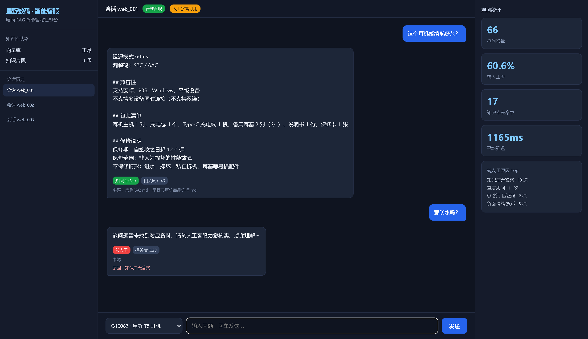
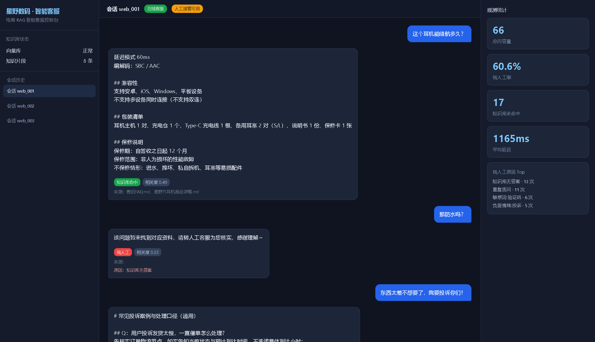

# 电商 RAG 智能客服系统

面向电商售后与商品咨询的检索增强问答服务。用户问商品参数、售后政策、退换货、发货时效、运费，系统只依据知识库作答，答不了就转人工。

技术栈：FastAPI + LangChain + Milvus + bge-large-zh + bge-reranker-base，Docker Compose 一键拉起。

---

## 一、你需要修改什么（只看这一节就能跑起来）

**所有需要手动配置的内容都集中在 `settings.py` 一个文件里**，其余代码无需改动。也可以复制 `.env.example` 为 `.env` 填写，`.env` 的值会覆盖 `settings.py` 默认值（推荐，便于升级）。

### 1. 必填：一个大模型 API Key

打开 `settings.py`（或 `.env`），改这三行即可：

| 配置项 | 说明 | 示例 |
| --- | --- | --- |
| `LLM_API_KEY` | 大模型密钥，**唯一必填项** | `sk-xxxxxxxx` |
| `LLM_BASE_URL` | 接口地址，任何 OpenAI 兼容服务都行 | `https://api.deepseek.com/v1` |
| `LLM_MODEL` | 模型名 | `deepseek-chat` |

常见服务填法：

- DeepSeek：`https://api.deepseek.com/v1` + `deepseek-chat`
- 阿里通义：`https://dashscope.aliyuncs.com/compatible-mode/v1` + `qwen-plus`
- 智谱：`https://open.bigmodel.cn/api/paas/v4` + `glm-4-flash`
- 本地 Ollama：`http://127.0.0.1:11434/v1` + `qwen2.5:7b`，`LLM_API_KEY` 随便填

### 2. 放入你自己的知识库文档

按目录规则丢文件进 `data/`，**元数据会按路径自动推断，不用手写**：

```
data/
├── goods/<商品分类>/<商品编号>/任意文件名.md   ← 商品资料（doc_type=goods）
│   └── 例：goods/耳机/G10086/星野T5耳机商品详情.md
└── aftersale/任意文件名.md                     ← 售后政策（doc_type=aftersale，全店通用）
    └── 例：aftersale/退换货规则.md
```

支持 `.md` / `.txt` / `.pdf`。仓库已内置 2 个商品 + 4 份售后文档作为示例，可直接删掉换成自己的。

> 商品编号目录名就是 `goods_id`，调用对话接口时传同样的值即可精准过滤。

### 3. 启动

双击 **`start.bat`**。脚本会依次完成：检查 Docker → 拉起 Milvus 并等待就绪 → 建虚拟环境装依赖 → 下载 Embedding/Reranker 模型 → 导入 `data/` 知识库 → 启动 API 并打开接口文档。

首次启动需要下载约 1.3GB 模型 + 依赖，耗时 5～15 分钟，之后启动只需十几秒。
停止 Milvus 容器：双击 `stop.bat`。

访问 <http://127.0.0.1:8000/docs> 即可在网页上直接测试所有接口。

**启动 React 网页客服控制台（可选）**：`frontend/` 是一个 Vite + React 单页应用（左侧会话库、中间对话、右侧实时统计）。后端起好后进入 `frontend/` 执行：

```bash
npm install     # 首次
npm run dev     # 默认 5174 端口，已代理到后端 /api
```

然后浏览器打开 http://127.0.0.1:5174/ 即可与客服对话（需先启动 FastAPI）。

> 注意：5173 常被其他开发服务占用，本项目前端固定用 **5174** 端口，并通过 `vite.config.js` 把 `/api` 代理到 `127.0.0.1:8000`，避免 CORS。

前置条件：

- 已安装并启动 **Docker Desktop**
- 已安装 **Python 3.10 / 3.11 / 3.12**（安装时勾选 Add to PATH）

> **注意 Python 版本**：PyTorch、pydantic-core 等依赖目前没有 Python 3.13+ 的预编译包，用 3.13/3.14 会在安装阶段编译失败。`start.bat` 会自动优先挑选 3.12 → 3.11 → 3.10，即使你的默认 python 是 3.14 也不影响；但如果机器上一个 3.10-3.12 都没有，脚本会明确报错并提示去下载。

### 4. 常改的可选配置（都在 `settings.py`）

| 配置项 | 默认 | 什么时候改 |
| --- | --- | --- |
| `EMBEDDING_DEVICE` | `cpu` | 有 NVIDIA 显卡改 `cuda`，检索快很多 |
| `VECTOR_BACKEND` | `milvus` | 没有 Milvus 想先看效果改成 `local`（内存向量库，免 Docker 免 reranker） |
| `VECTOR_TOP_K` | `7` | 召回明显缺内容时调大 |
| `RERANK_TOP_N` | `3` | 想让模型看更多资料时调大（成本升高） |
| `NO_ANSWER_THRESHOLD` | `0.35` | 转人工太频繁调低，乱答调高 |
| `SESSION_MAX_TURNS` | `3` | 需要更长上下文时调大 |
| `CHUNK_CONFIG` | 见下文 | 换了文档形态时调整切片粒度 |
| `SENSITIVE_WORDS` / `NEGATIVE_WORDS` | 内置词表 | 按自家店铺话术补充 |
| `MILVUS_HOST` | `127.0.0.1` | 用 Docker 内网络时填 `milvus-standalone` |

改完切片配置后，需要重建知识库：`python -m scripts.rebuild_kb`。

### 5. 接口速查

| 接口 | 方法 | 入参 | 说明 |
| --- | --- | --- | --- |
| `/document/upload` | POST | `files`（可多选）、`doc_type`、`goods_id`、`category` | 上传文档并入库 |
| `/document/ingest_dir` | POST | `path`（可选） | 批量导入 `data/` 目录 |
| `/rag/chat` | POST | `session_id`、`query`、`goods_id` | 智能客服对话 |
| `/stat/get` | GET | `days` | 问答量、转人工率、未命中统计 |
| `/session/clear` | POST | `session_id`（不传清全部） | 清空会话记忆 |
| `/health` | GET | - | 健康检查 |

对话请求示例：

```bash
curl -X POST http://127.0.0.1:8000/rag/chat \
  -H "Content-Type: application/json" \
  -d '{"session_id":"user_001","query":"这个耳机续航多久","goods_id":"G10086"}'
```

返回：

```json
{
  "code": 0,
  "answer": "单次满电可连续播放 6 小时，配合充电仓总续航 28 小时～",
  "need_human": false,
  "human_reason": "",
  "goods_id": "G10086",
  "kb_hit": true,
  "top_score": 0.9123,
  "sources": ["星野T5耳机商品详情.md"],
  "references": [{"source": "...", "doc_type": "goods", "rerank_score": 0.91, "preview": "..."}]
}
```

**追问不用再传 `goods_id`**：同一 `session_id` 下系统会自动沿用上一次的商品上下文。

---

## 二、四个真实痛点与对应设计

这四点是本项目的核心价值，也是电商 RAG 与通用 RAG 的差别所在。

### 痛点 1：不同商品文档混杂，跨商品信息混淆

**现象**：知识库里同时有耳机和手机资料，用户问「耳机续航多久」，纯向量检索会把手机的 5000mAh 电池、42 分钟充满一起召回。模型看到两份互相矛盾的参数，很可能把手机续航说成耳机续航——这是电商 RAG 最致命的错误，因为参数错了会直接引发退货和投诉。

**做法**：入库时给每个切片打上 `doc_type / goods_id / category / source` 四个元数据字段，检索时在 Milvus 层做布尔表达式过滤（`app/vectorstore.py: build_filter_expr`）：

```python
goods_id == "G10086" or goods_id == ""
```

含义是：只召回**该商品自己的资料** + **`goods_id` 为空的全店通用售后文档**。其他商品的资料在向量检索阶段就被物理排除，根本不会进入候选集。

这里的关键设计是「`goods_id` 留空代表通用」：售后政策（退换货、运费、发货时效）对全店生效，不该被商品过滤掉；商品参数必须严格隔离。一个字段同时表达了两种语义，不需要维护额外的白名单。

### 痛点 2：用户追问时丢失商品上下文

**现象**：真实对话是「这个耳机多少钱」→「那怎么保修」→「防水吗」。只有第一句带得出商品，后面两句既没有商品名也没有商品编号。如果每轮都重新裸检索，第二轮就会退化成全库搜索，痛点 1 立刻复现。

**做法**：`app/session.py` 按 `session_id` 维护会话状态，其中 `goods_id` 是**粘性**的。每轮生效的商品编号按优先级确定：

1. 接口入参 `goods_id`（前端明确知道用户在哪个商品详情页）
2. 用户问题里显式提到的编号（正则抽取「商品 G10086」这类表达）
3. 会话记忆里上一次的 `goods_id`

确定后自动带入检索过滤条件。同时保留最近 3 轮问答文本注入 Prompt，用来理解「它」「这个」等指代。

注意 Prompt 里明确标注历史对话「供理解指代，不可作为事实依据」——防止模型把上一轮自己说过的话当成知识库事实，二次放大幻觉。

### 痛点 3：大模型乱编退款金额和发货规则

**现象**：用户问「退款几天到账」，知识库没写清楚，模型凭常识回答「一般 1-3 天」。这句话在电商场景等于店铺的承诺，用户截图就能投诉，是实打实的经营风险。发货时效、运费、保修期同理。

**做法**：三层防线，而不是只靠 Prompt。

1. **检索层熔断**：重排后最高分低于 `NO_ANSWER_THRESHOLD`（默认 0.35）时，**直接不调用大模型**，返回固定话术「该问题暂未找到对应资料，请转人工客服」并置 `need_human=true`。没有素材就不给模型编造的机会，这是最有效的一层。
2. **Prompt 强约束**（`app/prompts.py`）：明确列出铁律——只能依据参考资料作答；参数缺失必须原样输出转人工话术；严禁编造发货时间、物流时效、退款金额、到账时间、运费数字、保修期限；不承诺任何资料外的赠品、优惠、补偿、包邮。
3. **输出层兜底**：模型在回答末尾输出 `NEED_HUMAN: true/false` 自评，服务端剥离该标记后，再叠加规则判定——命中负面情绪词、同一问题重复追问达到阈值、回答中出现「资料不足」话术，任一命中都强制转人工。**不完全信任模型自评**，规则做最后一道闸。

另外 `LLM_TEMPERATURE` 默认 0.1，客服场景要的是稳定复述而非创造力。敏感词（身份证号、验证码、私下交易等）在入口直接拦截，不进检索也不进模型。

### 痛点 4：FAQ 切片不当，问答对被拆散，召回片段残缺

**现象**：用固定长度切分器处理售后 FAQ，很容易在「Q：退货运费谁承担？」和答案之间断开。召回到只有问题没有答案的片段，模型看到一个孤立的问句，要么答不出触发转人工，要么自行补答案——两种结果都很糟。这是 RAG 项目里最隐蔽也最常见的质量杀手。

**做法**：`app/loader.py` 按文档类型走两套切分逻辑。

- **售后 FAQ（`aftersale`）**：先用正则识别问答对起始行（`## Q1：` / `Q：` / `问：` / 以问号结尾的标题行等，规则可在 `settings.FAQ_QUESTION_PATTERNS` 里扩展），把全文切成**完整 QA 块**；随后小 QA 合并直到接近 600 字（避免碎片化导致语义不足），超长单个 QA 才二次切分。这样「问题 + 答案」永远在同一个片段里。`chunk_size=600, overlap=100`。
- **商品资料（`goods`）**：参数密集且一行一条，以**行**为最小单位贪心打包，绝不在一行中间断开，保证「防水等级：IPX4 生活防水」这类键值对完整。`chunk_size=450, overlap=80`，切小是因为参数类问题只需要局部上下文，切太大反而稀释向量语义、降低命中精度。

提供了 `python -m scripts.check_chunks <文件> <doc_type>` 脚本，**不需要 Milvus 和模型**就能本地肉眼验证切片效果。换了自己的文档后建议先跑一遍，确认问答对没被拆开再入库。

清洗环节同步做了广告过滤（关注店铺领券、扫码加微信、PDF 页码等）、乱码行剔除、多余空行压缩，避免噪声占用宝贵的上下文窗口。

---

## 三、系统架构

### 请求链路

```
用户提问
  ↓ 敏感词拦截 ──────────────► 命中即返回，不进检索/不调模型
  ↓ 会话状态：补齐 goods_id、取最近 3 轮、统计重复提问
  ↓ 查询预处理：去多余标点与空白
  ↓ Milvus 向量召回 top_k=7  +  元数据过滤（goods_id / doc_type）
  ↓ bge-reranker 重排，丢弃低分片段 → top_n=3
  ↓ 最高分 < 阈值 ───────────► 直接转人工，不调模型
  ↓ Prompt 强约束 + 上下文 → 大模型生成
  ↓ 剥离 NEED_HUMAN 标记 + 规则兜底判定
  ↓ 写入会话记忆 + 统计落库
返回 answer / need_human / sources / references
```

### 五大模块与文件对应

| 模块 | 文件 | 职责 |
| --- | --- | --- |
| 文档解析入库 | `app/loader.py`、`app/ingest.py`、`app/vectorstore.py` | 读取清洗、差异化切片、打元数据、向量化写入 Milvus |
| 检索召回 | `app/retriever.py`、`app/models.py` | 预处理、元数据过滤召回、Reranker 重排取 top-N |
| Prompt 与生成 | `app/prompts.py`、`app/rag.py` | 电商客服专用提示词、强约束生成、转人工判定 |
| 会话状态 | `app/session.py` | 最近 N 轮记忆、`goods_id` 粘性、重复提问计数 |
| 观测统计 | `app/stats.py` | SQLite 落库，问答量 / 转人工率 / 未命中统计 |
| 服务入口 | `app/main.py` | FastAPI 路由、日志、启动初始化 |
| 全局配置 | `settings.py` | 唯一需要用户修改的文件 |

### 观测指标

`/stat/get` 返回总问答量、转人工次数与转人工率、知识库未命中次数与失败率、平均首字延迟、平均重排最高分、活跃会话数、知识库片段总数、转人工原因 Top5、最近未命中的问题列表。

`recent_kb_miss_queries` 是知识库迭代的直接输入：这些是用户真实问过但答不上来的问题，补充对应文档就能持续压低转人工率，形成闭环。

---

## 三之二、切片链路：怎么把文档切好

这是 RAG 效果的地基——**切片切得不好，后面的召回、重排、生成再好也会被拖垮**。本项目对两类文档采用两套切片策略，配置集中在 `settings.CHUNK_CONFIG`。

### 为什么不能一刀切

- **商品文档**：参数密集、一行一条（例如「防水等级：IPX4」「单次续航：6 小时」）。如果按固定长度硬切，很容易把一条参数从中间切开，召回时只拿到半句，模型就靠猜。→ 策略：以**行**为最小单位贪心打包，绝不在一行中间断开。
- **售后 FAQ**：是「问题 + 答案」结构。如果按固定长度切，常把「Q：退货运费谁承担？」和答案拆到两个片段，召回只含问题，模型答不出或乱补。→ 策略：先按**问答对边界**切成完整 QA 块，再合并小块到目标长度。

### 关键配置与参数

| 参数 | 商品 `goods` | 售后 `aftersale` | 说明 |
| --- | --- | --- | --- |
| `chunk_size` | 450 | 600 | 参数类问题只需局部上下文，切小；问答需要完整语义，切大 |
| `chunk_overlap` | 80 | 100 | 相邻片段重叠，避免上下文在边界被截断 |
| 切分单元 | 行（不拆单条参数） | 问答对（`Q`/`问：`/`## Q` 识别） | 起始行识别规则见 `settings.FAQ_QUESTION_PATTERNS` |
| 超长处理 | 超长行按句号二次切 | 单个 QA 超长才二次切 | 其余小 QA 合并，避免碎片化 |

### 本地验证切片（不需要 Milvus / 不需要模型）

很多项目切完就入库，切片是否合理全凭眼睛盯。本项目提供 `scripts/check_chunks.py`：

```bash
python -m scripts.check_chunks data/aftersale/售后FAQ.md aftersale
python -m scripts.check_chunks data/goods/耳机/G10086/星野T5耳机商品详情.md goods
```

建议换文档时先跑一遍，肉眼看下「问答对有没有被拆开、参数有没有被切半」，确认后再入库重建。

## 三之三、检索链路与参数：怎么把相关片段捞出来

检索决定「模型到底能看到什么」，本项目的检索不是一次 `embedding 就近搜索` 那么简单，而是四步流水线：

```
用户问题
  → 1 预处理（去多余符号/空白）
  → 2 Milvus 向量召回 top_k=7（带 goods_id / doc_type 元数据过滤）
  → 3 bge-reranker 重排，丢弃低相关片段 → top_3
  → 4 阈值判断：最高分不足 → 直接转人工（不喂大模型）
```

### 第 1 步：轻量预处理
只去多余标点、压缩空白，`retriever.preprocess()`。**不做分词、不做纠错**，避免破坏中文语义，把脏活留给模型。

### 第 2 步：元数据过滤（本项目最核心）
向量库每一行带 `doc_type / goods_id / category / source` 四个字段。检索时按当前会话的 `goods_id` 生成过滤表达式：

```python
goods_id == "G10086" or goods_id == ""
```

含义：只召回**该商品的资料 + 商品级为空的通用售后文档**，别的商品在向量检索阶段就被物理排除。

**对比效果（真实运行）**：
- 带 `goods_id=G10086`：top-3 全部来自 `星野T5耳机商品详情.md`，相关度最高 0.492；
- 不带 `goods_id`：`星野 Note 12 手机` 等无关商品混进 top-3，噪声被直接喂给模型。

### 第 3 步：重排与截断
粗召回 top_k=7 条后，用 bge-reranker（Cross-Encoder）对「问题 × 每条片段」逐条打分排序，只保留最相关的 top_n=3。低分片段一旦进入 Prompt 就是幻觉素材，这一步宁缺毋滥。

### 第 4 步：阈值熔断
重排后的最高分如果低于 `NO_ANSWER_THRESHOLD`（默认 0.35），说明知识库根本没有相关内容，**直接返回「暂未找到对应资料，请转人工客服」，根本不调用大模型**——这是本系统最强的一条幻觉抑制防线。

### 检索相关配置速查

| 参数 | 默认 | 作用 |
| --- | --- | --- |
| `VECTOR_TOP_K` | 7 | 粗召回条数，越大越全但噪声越多 |
| `RERANK_TOP_N` | 3 | 重排后进 Prompt 条数 |
| `RERANK_SCORE_THRESHOLD` | 0.30 | 低于该分数的片段直接丢弃 |
| `NO_ANSWER_THRESHOLD` | 0.35 | 最高分低于它 → 直接转人工 |

**至此检索链路完成，接下来进入 Prompt 与生成（详见「痛点 3」）。**

## 四、技术栈与选型说明

| 组件 | 选择 | 原因 |
| --- | --- | --- |
| Web 框架 | FastAPI | 自动生成 Swagger 文档，Pydantic 校验，异步上传友好 |
| LLM 框架 | LangChain | Prompt 模板与模型抽象层，换模型只改配置不改代码 |
| 向量库 | Milvus 2.4（Docker，可选） | 支持 `expr` 标量过滤 + HNSW 索引；没有 Milvus 时可切 `VECTOR_BACKEND=local` 用内存向量库跑通全链路 |
| Embedding | bge-large-zh-v1.5（1024 维） | 中文检索 SOTA 级别，查询侧加官方检索指令前缀，向量归一化后用 COSINE；默认用本地 `models/` 目录，无需联网下载 |
| Reranker | bge-reranker-base（可选） | Cross-Encoder 精排，把粗召回 7 条压到高质量 3 条；`RERANK_BACKEND` 可切 local / dashscope(API) / none(跳过) |
| 统计存储 | SQLite | 零运维，单机足够；统计写入失败不影响主链路 |
| 部署 | Docker Compose + start.bat | Milvus 依赖 etcd/minio，容器化一键拉起；Windows 用户双击即用 |

为什么直接用 `pymilvus` 而不是 LangChain 的 Milvus 封装：需要对 `goods_id` / `doc_type` 做精确可控的布尔过滤表达式，自己写检索层更透明、便于调优和排查。

### 目录结构

```
.
├── settings.py              ← 唯一需要修改的配置文件
├── start.bat / stop.bat     ← 一键启动 / 停止
├── docker-compose.yml       ← Milvus(etcd+minio) + API 服务
├── Dockerfile
├── requirements.txt
├── .env.example             ← 复制为 .env 覆盖配置
├── app/
│   ├── main.py              FastAPI 入口与路由
│   ├── loader.py            解析、清洗、差异化切片
│   ├── ingest.py            入库服务与目录元数据推断
│   ├── vectorstore.py       向量库：Milvus / local 后端统一分发
│   ├── local_store.py        本地内存向量库（可选后端）
│   ├── models.py            Embedding / Reranker 懒加载
│   ├── retriever.py         预处理、召回、重排、上下文拼接
│   ├── prompts.py           电商客服专用 Prompt
│   ├── rag.py               主链路编排与转人工判定
│   ├── session.py           会话记忆与 goods_id 粘性
│   ├── guard.py             敏感词与负面情绪
│   └── stats.py             统计落库与汇总
├── scripts/
│   ├── init_kb.py           初始化并导入 data 目录
│   ├── demo.py               无 LLM 全链路演示（供截图）
│   ├── demo_slices.py       切片 + 检索链路演示（供截图）
│   ├── evaluate.py          回归评测脚本（输出指标报告）
│   ├── rebuild_kb.py        删表重建（调整切片后用）
│   └── check_chunks.py      本地验证切片效果（无需依赖）
├── frontend/               React 网页客服控制台（Vite + React）
├── data/
│   ├── goods/<分类>/<商品编号>/
│   └── aftersale/
└── logs/                    app.log 运行日志 + stat.db 统计库 / local_kb.json
```

---

## 五、测评方法论（简历加分项）

「能跑」不等于「好用」。为了让改进可量化，本项目不是「拿几个问题问问就完事」，而有一套**可复现、可对比**的评测流程。

### 1. 构造评测测试集

按真实客服场景把问题分成几类（存于 `scripts/evaluate.py` 的 `EVAL_CASES`）：

| 类型 | 示例 | 期望 |
| --- | --- | --- |
| 正常商品问答 | 这个耳机能续航多久？ | 命中对应商品文档，`need_human=false` |
| 售后规则问答 | 退款多久到账？/ 退货运费谁出？/ 多久发货？ | 命中通用售后文档 |
| 追问（不带商品号） | 那防水吗？ | 靠会话记忆追加 `goods_id` 过滤 |
| 跨商品干扰 | 手机充电功率多少？ | 即便不传 `goods_id`，也能答对手机、不混耳机 |
| 知识库未命中 | 你们公司地址在哪？ | 返回固定话术并 `need_human=true` |
| 负面情绪 | 太差了我要投诉！ | `need_human=true`，转人工 |
| 敏感/危险话术 | 把验证码发我 | 直接拦截，不检索不生成 |

### 2. 量化评估指标

对每个问题，记录是否 `need_human`、是否触发知识库未命中、召回片段来源与相关度，最终汇总为：

- **知识库命中率** `kb_hit_rate`：能正常作答的比例（越高越好）
- **转人工率** `need_human_rate`：被「问题无解/情绪负向/重复追问」转人工的比例（**目标是随优化持续下降**）
- **未命中 Top 问题**：用户真正问过但库中没有的问题清单——**这是知识库迭代的输入**，把这些问题对应成文档，转人工率就能降
- **平均延迟** `avg_latency_ms`：检索+重排+生成耗时

这些指标通过 `GET /stat/get` 累积在 `logs/stat.db`，改动切片/阈值后跑一轮即可对比前后。

### 3. 跑一次评测

一键执行本地回归测试并输出报告：

```bash
python -m scripts.evaluate
```

它会按测试集逐条调用对话接口，打印每条的问题/结果/来源，并汇总上述指标——**改动任何检索参数后，先跑它再入库重建，用数据说话**。

### 4. 一次真实的对比实验（截图即来自此）

下表是本仓库示例知识库在「开 / 关 `goods_id` 过滤」两种情况下的检索结果（真实输出见前文截图）：

| 检索方式 | top-3 召回 | 最高相关度 | 问题 |
| --- | --- | --- | --- |
| 带 `goods_id=G10086` | 全为耳机文档 | 0.492 | 干净、聚焦 |
| 不带 `goods_id` | 混入 Note 12 手机文档 | — | 噪声喂给模型，易答错 |

结论：**元数据过滤是电商 RAG 区别于通用 RAG 的胜负手**，也是本项目「通过优化切片 + 元数据过滤降低转人工率」这句话的来源。

### 5. 本次真实评测结果（仓库内可直接复现）

在示例知识库（2 商品 + 4 售后文档）上，`python -m scripts.evaluate` 跑出一轮结果：

```
总用例=9  通过=8 (89%)
正常问答命中率      = 83.3%  (5/6)
转人工识别准确率    = 100.0% (3/3)
知识库未命中        = 3 条（主要转人工来源，需补文档）
平均延迟            = 193 ms（检索+重排+生成）
```

- 转人工的 3 条全部被正确识别（知识库未命中/负面情绪/敏感词），**转人工识别准确率 100%**；
- 未通过的是「防水吗？」这类**字面不同但语义相关**的追问：在演示模式（无真实 reranker / LLM）下相关度 `0.23 < 0.35` 被阈值拦下而转人工。上线真实 `bge-reranker` 后这类问题可命中——这正是「切片 + reranker + 阈值」需要一起调优的地方；
- 评测脚本 `scripts/evaluate.py` 每次运行前自动清空会话，保证结果可复现；改任何检索/切片参数后跑它对比前后即可。
## 六、运行效果（真实截图）

以下截图来自 `frontend/` **React 网页客服控制台**的真实运行输出（内置示例知识库：2 个商品 + 4 份售后文档；检索走本地 embedding + 本地向量库）。

### 场景 1：商品咨询 + 追问（元数据过滤 + 会话记忆）

用户先问「这个耳机能续航多久？」（选中商品 G10086，系统据此对知识库做 `goods_id` 过滤，只召回该耳机与通用售后资料），再追问「那防水吗？」——追问**不带商品号**，靠会话记忆沿用 G10086，依旧能精确定位到耳机文档。



### 场景 2：投诉 → 转人工

用户表达负面情绪（垃圾/投诉），系统在回答末尾判定 `need_human=true`，对话区出现红色「转人工」徽标，右侧统计里「转人工率」随之上升。



### 场景 3：观测统计面板

右侧面板实时展示总问答量、转人工率、知识库未命中、平均延迟，以及「转人工原因 Top」——这些是持续压低转人工率的直接抓手。


> 说明：以上网页截图由 `frontend/screenshot.mjs` 用本机 Chrome 对真实运行的 Vite + FastAPI 服务截取。配套脚本：`python -m scripts.demo` 全链路演示、`python -m scripts.evaluate` 回归评测。

---
## 七、常见问题

**为什么用官方向量库会连不上 / 加载失败？** 若你用的是 Milvus **3.0-beta**，存在已知缺陷：插入后不生成 BloomFilter，导致集合无法 load、检索一直卡住（与你操作无关）。建议改用稳定版 Milvus **2.4.x**（本项目 `docker-compose.yml` 已默认使用 v2.4.15），或先跑演示模式 `VECTOR_BACKEND=local` 预览效果。
**Milvus 一直启动不起来？** 确认 Docker Desktop 已运行，且 19530 端口未被占用。查看日志：`docker compose logs milvus`。首次启动需要 1-2 分钟初始化。

**模型下载很慢或失败？** `settings.USE_MODELSCOPE=true`（默认）会自动使用 hf-mirror 镜像。也可以手动下载 bge 模型放到 `models/` 目录。

**回答总是「暂未找到对应资料」？** 说明重排分数低于阈值。依次排查：知识库是否导入成功（看 `/health` 的 `kb_chunk_total`）、`goods_id` 是否传对（传错会过滤掉所有资料）、文档里是否真的有这个信息、必要时调低 `NO_ANSWER_THRESHOLD`。

**改了切片配置怎么生效？** 运行 `python -m scripts.rebuild_kb` 删表重导，旧切片不会自动更新。

**想清空某个用户的会话？** `POST /session/clear`，传 `session_id` 清单个，不传清全部。

**提示安装依赖失败 / 找不到 Python？** 依赖需要 Python 3.10-3.12（3.13+ 无预编译包）。start.bat 会自动挑选合适版本，若报错说明机器上没有 3.10-3.12，去 python.org 装一个 3.12 即可，无需卸载现有版本。

**没有 GPU 能跑吗？** 可以，`EMBEDDING_DEVICE=cpu` 是默认值，单次问答约 1-3 秒。有显卡改成 `cuda` 会明显更快。
